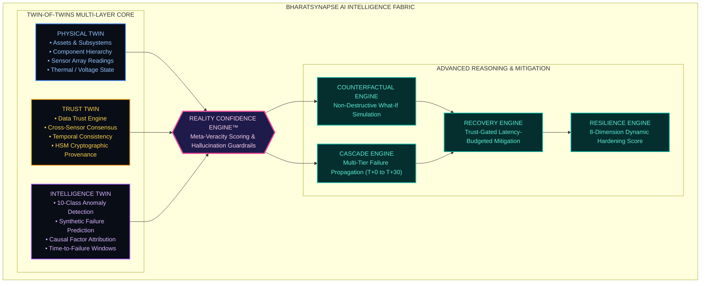
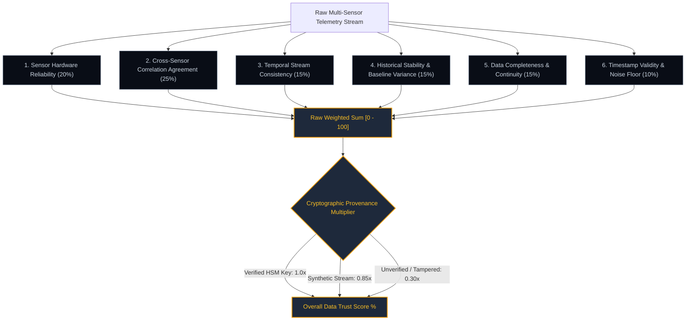
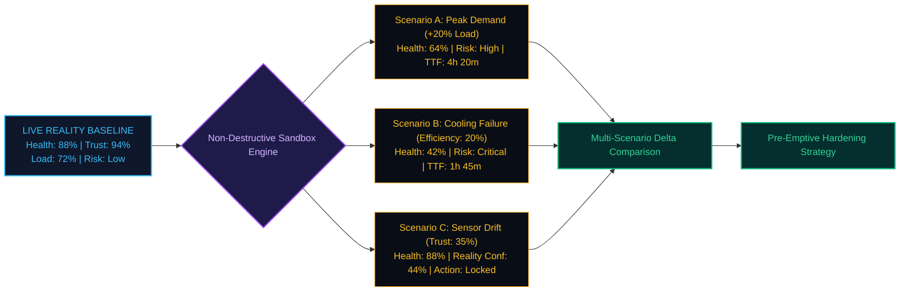
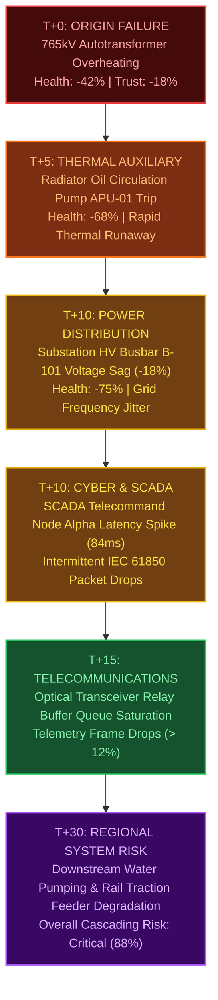
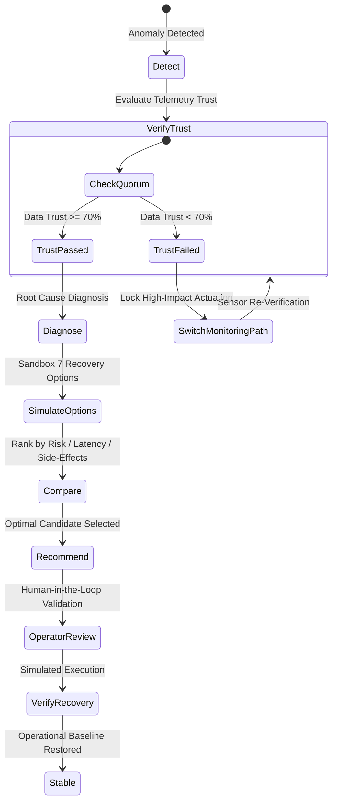
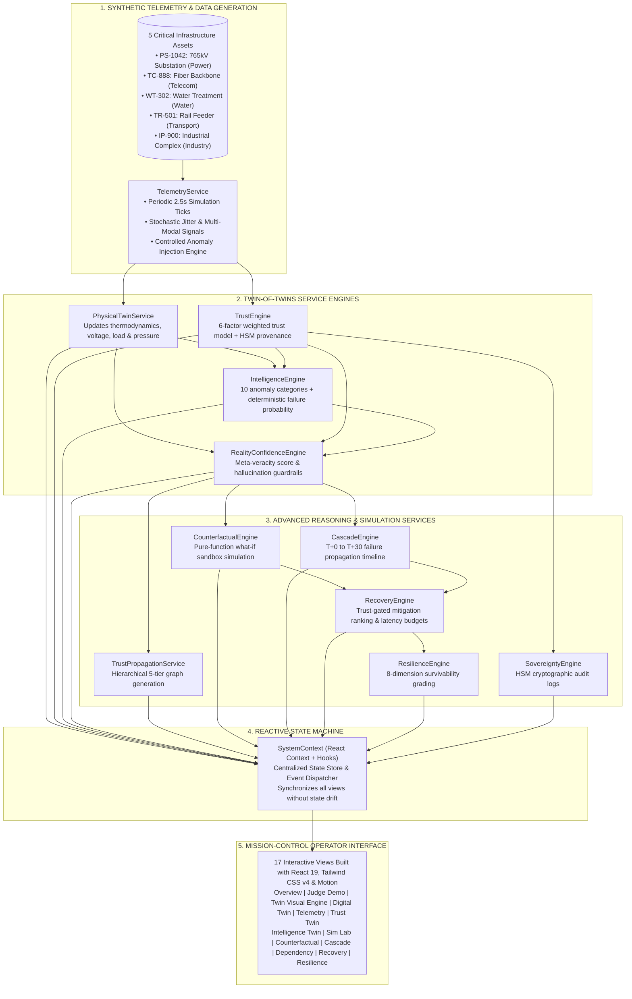

# BharatSynapse AI

> **Indigenous Trust-Aware Digital Twin Intelligence Fabric for Critical Infrastructure**

BharatSynapse AI is an architectural prototype that introduces **Data Trust** as a foundational, first-class intelligence layer within Digital Twin systems. Designed for national critical infrastructure—spanning high-voltage electrical grids, telecommunications backbones, potable water grids, and railway signaling—it moves beyond naive observation to establish whether sensory inputs can be trusted before simulating future states, predicting failures, or recommending high-impact recovery procedures.

[](https://www.typescriptlang.org/)
[](https://react.dev/)
[](https://vitejs.dev/)
[](https://tailwindcss.com/)
[](https://motion.dev/)
[](https://nodejs.org/)
[](#-twin-of-twins-architecture)
[](#-prototype--simulation-status)
[](LICENSE)

---

## 🧭 Overview
#LINK-

### The Problem
Modern supervisory and control architectures (SCADA, Energy Management Systems, IoT sensor meshes) continuously observe critical infrastructure. Predictive artificial intelligence algorithms ingest these signals to forecast component failure risks, and traditional Digital Twins simulate operating parameters.

However, existing systems share a dangerous architectural blind spot:

$$\text{Observation} \ne \text{Trust} \quad\land\quad \text{Prediction} \ne \text{Truth} \quad\land\quad \text{Digital Model} \ne \text{Guaranteed Reality}$$

When telemetry sensors experience calibration drift, thermal freeze, packet loss, or malicious cyber-physical tampering, predictive AI models blindly ingest corrupted data. This leads to **hallucinated catastrophic predictions** (causing unnecessary, expensive emergency shutdowns) or **false-negative blind spots** (where real physical degradation is hidden behind frozen normal readings).

### Our Approach
BharatSynapse AI solves this vulnerability by introducing the **Twin-of-Twins Architecture**. Rather than feeding telemetry straight from physical sensors into predictive AI models, the fabric routes all data through a dedicated **Trust Twin** that verifies telemetry veracity in real time. 

The system operates across a five-phase intelligence pipeline:
$$\mathbf{SENSE} \;\longrightarrow\; \mathbf{VERIFY} \;\longrightarrow\; \mathbf{PREDICT} \;\longrightarrow\; \mathbf{SIMULATE} \;\longrightarrow\; \mathbf{RECOVER}$$

By computing a mathematically grounded **Reality Confidence Score™**, the system determines whether its digital state matches ground-truth physical reality, enforcing an autonomous safety interlock whenever telemetry integrity cannot be proven.

---

## 💡 Why BharatSynapse AI?

### The Reality Gap in Critical Infrastructure
In safety-critical sectors, acting on untrusted predictions can trigger regional blackouts or transportation halts. BharatSynapse AI introduces explicit distinctions between four operational metrics:

| Metric | Conceptual Question | What It Measures | What Influences It |
| :--- | :--- | :--- | :--- |
| **System Health** | *"How physically operational is the asset?"* | Mechanical, electrical, and thermal health of physical components (0–100%). | Temperature, winding load, SF6 gas pressure, vibration, bus voltage. |
| **Data Trust** | *"Can we trust the incoming sensor stream?"* | Cryptographic validity, statistical consistency, and sensor reliability (0–100%). | Calibration status, peer-sensor consensus, freeze detection, packet continuity. |
| **Prediction Confidence** | *"How confident is the AI model in its output?"* | Algorithmic certainty of the synthetic failure prediction model (0–100%). | Model weight distribution, historical feature alignment, training convergence. |
| **Reality Confidence** | *"Does the digital twin reflect physical reality?"* | **Meta-veracity index** ensuring the twin represents physical ground truth (0–100%). | Mathematical synthesis of Data Trust, peer consensus, and model-data divergence. |

```
              ┌────────────────────────────────────────────────────────┐
              │           THE REALITY CONFIDENCE PRINCIPLE             │
              ├────────────────────────────────────────────────────────┤
              │                                                        │
              │   High System Health  +  LOW Data Trust               │
              │   ────────────────────────────────────────             │
              │   = UNVERIFIED REALITY                                 │
              │   Autonomous actuators LOCKED. Operator alert raised.  │
              │                                                        │
              │   Low System Health   +  HIGH Data Trust               │
              │   ────────────────────────────────────────             │
              │   = VERIFIED PHYSICAL FAILURE                          │
              │   High Reality Confidence. Recovery engine engaged.   │
              │                                                        │
              │   High AI Confidence  +  LOW Data Trust               │
              │   ────────────────────────────────────────             │
              │   = SEVERE HALLUCINATION RISK                          │
              │   Reality Confidence penalised. Action inhibited.      │
              │                                                        │
              └────────────────────────────────────────────────────────┘
```

---

## 🔄 Core Intelligence Loop


1. **SENSE**: Ingests multi-modal IoT telemetry frames (temperature, voltage, load, pressure, vibration, network latency, bit error rates).
2. **VERIFY**: Evaluates sensory reliability across 6 mathematical trust dimensions, testing for drift, freezing, and peer divergence.
3. **PREDICT**: Models component failure windows, generating deterministic probability distributions and natural language evidence trails.
4. **SIMULATE**: Tests counterfactual what-if stresses and multi-tier cascading propagation timelines without altering live operations.
5. **RECOVER**: Synthesizes trust-gated mitigation strategies, enforcing a human-in-the-loop review before physical execution.

---

## 🧠 Twin-of-Twins Architecture



### 1. Physical Twin
Maintains the engineering representation of physical infrastructure assets, components, and telemetry transducers. It tracks physical operating parameters (temperatures in °C, busbar voltage in kV, fluid pressure in bar, vibration in mm/s, operating hours, and maintenance records).

### 2. Trust Twin
Operates as an independent verification observer. It evaluates incoming data packets against physical plausibility, historical bounds, and spatial redundancy. It determines whether signals originate from an authentic transducer or represent drifting, degraded, frozen, or tampered payloads.

### 3. Intelligence Twin
Contains analytical reasoning algorithms that compute failure probabilities, estimate time-to-failure countdown windows, isolate anomalous deviations, and calculate causal attribution weights. Crucially, its predictions are explicitly conditioned on the Trust Twin.

### 4. Reality Confidence Engine
The unifying synthesis engine. It calculates the **Reality Confidence Score™** ($RC \in [0, 100]$):

$$RC = \Big(w_{\text{trust}} \cdot DT + w_{\text{consensus}} \cdot CSA + w_{\text{temporal}} \cdot TC + w_{\text{complete}} \cdot DC\Big) + \Big(w_{\text{model}} \cdot PC + w_{\text{state}} \cdot SC\Big) - P_{\text{gap}}$$

Where:
* $DT$ = Overall Data Trust (40% weight)
* $CSA$ = Cross-Sensor Agreement consensus (20% weight)
* $TC$ = Temporal stream consistency (15% weight)
* $DC$ = Data completeness index (10% weight)
* $PC$ = Model prediction confidence (10% weight)
* $SC$ = Physical state consistency (5% weight)
* $P_{\text{gap}}$ = Hallucination penalty applied whenever AI prediction confidence wildly outstrips underlying data trust ($PC - DT > 20\%$)

---

## 🔐 Trust Intelligence

### Implemented Trust Scoring Weights
The Trust Twin implements a deterministic, multi-factor scoring model across six discrete validation dimensions:



| Trust Dimension | Implemented Weight | Operational Verification Function | Failure / Penalty Trigger |
| :--- | :---: | :--- | :--- |
| **Cross-Sensor Agreement** | **25%** | Cross-correlates readings among co-located sensor arrays (e.g. Sensors A, B, and C measuring autotransformer winding temperature). | Divergence $> 20\%$ from peer mean incurs up to $-45$ trust penalty points. |
| **Sensor Hardware Reliability** | **20%** | Tracks calibration age, firmware integrity, and hardware fault status flags. | Degraded or drifting calibration status reduces individual reliability score. |
| **Temporal Stream Consistency** | **15%** | Verifies physiological micro-fluctuations and signal jitter to detect transducer freeze. | 3+ consecutive static telemetry frames (flatline) penalizes temporal score to $40\%$. |
| **Historical Stability** | **15%** | Validates rate-of-change ($\frac{d}{dt}$) limits against thermodynamic physical boundaries. | Physically impossible step changes penalize historical consistency by $-22$ pts/sensor. |
| **Data Completeness** | **15%** | Measures packet loss rate and missing payload attributes over sliding telemetry windows. | Dropped packets and missing payloads reduce continuity index directly. |
| **Timestamp Validity** | **10%** | Assesses clock skew, frame sequence numbers, and replay attack patterns. | Out-of-order sequence frames or timestamps exceeding latency bounds trigger $-65$ pts penalty. |

### Trust Propagation Graph
Trust degradation does not remain isolated to a single probe. BharatSynapse AI models hierarchical trust propagation through five structural tiers:

```
[ Tier 0: Sensor ] ──> [ Tier 1: Component ] ──> [ Tier 2: Asset ] ──> [ Tier 3: Interdependent System ]
  Sensor B Drifts          Autotransformer          Substation PS-1042        Downstream Water / Rail Grids
 (Trust: 35%)            (Trust: 52%)             (Trust: 61%)              (Trust: 74%)
        │
        └───> [ Tier 4: AI Prediction ] ───> [ Tier 5: Autonomous Decision Gate ]
                Prediction Confidence                AUTONOMOUS ACTUATION LOCKED
                Capped / Hallucination Flagged       (Operator Verification Required)
```

---

## 🤖 AI & Intelligence Layer

The Intelligence Twin provides deterministic, explainable AI reasoning over physical and trust twin states:

| Capability | Purpose | Input Signals | Output Metrics & Artifacts |
| :--- | :--- | :--- | :--- |
| **Anomaly Detection** | Identifies anomalous physical deviations across 10 distinct failure categories. | Telemetry values vs. expected operating bounds, signal rates of change. | Anomaly severity, observed vs. expected delta, confidence %, and natural language impact statement. |
| **Failure Risk Prediction** | Estimates probability of imminent infrastructure breakdown. | Temperature deviation, load surge, cooling loss, vibration, telemetry error rate, and trust penalty. | Failure probability (0–98%), estimated time-to-failure countdown window, and risk classification. |
| **Causal Attribution** | Quantifies factor contributions driving failure probability increases. | Multi-variate feature deltas relative to baseline operating states. | SHAP-style waterfall contributing factors with percentage impact weights and directions. |
| **Evidence Generation** | Produces verifiable audit trails explaining the rationale behind alerts. | Cross-twin correlation logs, timestamp sync audits, and sensor drift records. | Human-readable bulleted evidence statements for control room operators. |
| **Safety Interlock Gate** | Inhibits automated actions when telemetry cannot be proven trustworthy. | Reality Confidence Score™ and Data Trust threshold ($< 70\%$). | Autonomous command lockout, safety advisory notice, and verification prompt. |

### 10 Implemented Anomaly Detection Categories
1. **Temperature Spike**: Detects winding and oil thermal surges exceeding normal operating envelopes ($> 72^\circ\text{C}$).
2. **Voltage Instability**: HV busbar voltage excursions beyond $\pm 10\,\text{kV}$ nominal rating.
3. **Pressure Deviation**: SF6 gas / cooling dielectric oil pressure leakage or over-pressurization.
4. **Load Surge**: Current loads exceeding continuous thermal dissipation thresholds ($> 80\%$).
5. **Latency Spike**: SCADA telecommand buffer latency spikes ($> 10\,\text{ms}$) delaying protection trips.
6. **Packet Loss**: Optical edge network frame drops ($> 0.05\%$) causing telemetry blind spots.
7. **Error-Rate Jump**: Digital telecommunications bit error rate (BER) jumps causing checksum rejections.
8. **Sensor Disagreement**: Multi-probe consensus failure (e.g. Sensor B reading $43^\circ\text{C}$ while peer sensors read $82^\circ\text{C}$).
9. **Resource Saturation**: Edge SCADA controller CPU/RAM exhaustion risking watchdog reboots.
10. **Vibration Anomaly**: Acoustic and mechanical transducer vibrations ($> 2.0\,\text{mm/s}$) indicating core clamping looseness.

---

## 🧪 Counterfactual / What-If Engine

The Counterfactual Engine enables control room engineers and operators to simulate alternative future states **without altering the live operational baseline**. 



### Interactive Sandbox Control Parameters
* **Operating Load** ($10\% - 120\%$): Simulates surge demand during heatwaves or industrial peaks.
* **Operating Temperature** ($20^\circ\text{C} - 120^\circ\text{C}$): Evaluates thermal insulation degradation.
* **Dielectric Pressure** ($1.0 - 8.0\,\text{bar}$): Tests SF6 gas containment failure.
* **Busbar Voltage** ($600 - 900\,\text{kV}$): Simulates grid voltage excursions.
* **Cooling Efficiency** ($0\% - 100\%$): Models radiator fan and circulation pump degradation.
* **Network Latency** ($1 - 100\,\text{ms}$): Simulates telecommunications congestion on SCADA lines.
* **Sensor Reliability** ($10\% - 100\%$): Simulates sensor degradation to test system robustness.
* **Active Redundancy** ($N+0, N+1, N+2, N+3$): Evaluates reserve capacity impact on failure probability.
* **Recovery Latency Budget** ($5 - 240\,\text{min}$): Tests whether recovery can be achieved before thermal runaway.

All calculations execute as pure mathematical functions, returning comparative delta metrics ($\Delta\text{Health}$, $\Delta\text{Trust}$, $\Delta\text{Risk}$, $\Delta\text{Resilience}$) while preserving live system state.

---

## 🌐 Cascading Risk & Dependency Intelligence

In coupled national infrastructure, a local failure rarely remains contained. BharatSynapse AI models multi-sector dependency cascades across power, telecom, water, and transport networks:



The Cascade Engine tracks propagation across 5 timeline intervals (**T+0, T+5, T+10, T+15, T+30**), mapping affected subsystem nodes, quantifying health drops, and determining the exact moment when localized degradation becomes an irreversible regional cascade.

---

## 🛡️ Resilience & Recovery

Traditional infrastructure software alerts operators when systems break. BharatSynapse AI guides operators through validated, trust-checked mitigation:

```
1. PREDICTION: "What may fail?"
   └── 765kV Autotransformer #1 predicted failure in 1h 45m due to cooling pump failure.

2. SIMULATION: "What happens if it fails?"
   └── Downstream busbar voltage sag trips water treatment pumps and rail traction lines within 30 minutes.

3. RECOVERY: "What can we do about it?"
   └── Trust-Aware Recovery Pipeline simulates, ranks, and compares candidate mitigation strategies.
```

### Trust-Gated Recovery Pipeline
Before generating recovery options, the recovery engine enforces the mandatory trust gate:

$$\text{Data Trust} \ge 70\% \implies \text{PROCEED TO PHYSICAL RECOVERY SIMULATION}$$
$$\text{Data Trust} < 70\% \implies \text{SWITCH MONITORING PATH \& RE-VERIFY TELEMETRY FIRST}$$



### Candidate Recovery Options Evaluated
The Recovery Engine simulates and ranks 7 standard mitigation options:
1. **Activate Redundant Cooling (N+1)**: Activates secondary radiator bank; risk reduction: $78\%$, recovery time: $12\,\text{min}$, trust requirement: $85\%$.
2. **Reduce Load (-30%)**: Sheds non-essential downstream feeders; risk reduction: $62\%$, recovery time: $8\,\text{min}$, trust requirement: $70\%$.
3. **Switch Monitoring Path**: Reroutes telemetry through secondary optical fiber link; restores trust by $+45\%$, recovery time: $5\,\text{min}$.
4. **Isolate Affected Component**: Opens circuit breakers to air-gap faulty subsystem; risk reduction: $90\%$, but imposes downstream supply interruptions.
5. **Increase Telemetry Verification**: Increases sampling frequency from $1\,\text{Hz}$ to $100\,\text{Hz}$ with cryptographic checksumming.
6. **Increase Cooling Capacity**: Overclocks SF6 coolant circulation to dissipate peak thermal energy.
7. **Status Quo (No Action)**: Baseline comparison demonstrating thermal runaway within $18\,\text{minutes}$.

### BharatSynapse Resilience Score™
Evaluates overall asset survivability across eight weighted dimensions:
* **System Health** ($15\%$ weight)
* **Data Trust** ($15\%$ weight)
* **Failure Risk Inversion** ($15\%$ weight)
* **Redundancy Index** ($15\%$ weight)
* **Recovery Readiness** ($10\%$ weight)
* **Recovery Latency Budget** ($10\%$ weight)
* **Checkpoint Freshness** ($10\%$ weight)
* **Dependency Risk** ($10\%$ weight)

Assigns an executive survivability grade: **SUPREME RESILIENCE (AAA)**, **HIGH RESILIENCE (AA)**, **MODERATE RESILIENCE (A)**, or **CRITICAL VULNERABILITY (B)**.

---

## 🖥️ Prototype / Demo Interface

The prototype includes an aerospace-grade, high-density dark command center containing **17 modular views**:

```
┌────────────────────────────────────────────────────────────────────────────────────────┐
│ BHARATSYNAPSE AI  ::  TRUST-AWARE DIGITAL TWIN INTELLIGENCE FABRIC       [v3.8-PROTOTYPE]│
├────────────────────────────────────────────────────────────────────────────────────────┤
│ [🏆 JUDGE DEMO MODE]  [● LIVE SIMULATION: ACTIVE]  [RECALIBRATE TRUST]  [SYSTEM HEALTH: 94%]│
├───────────────┬────────────────────────────────────────────────────────────────────────┤
│ NAVIGATION    │ ACTIVE VIEWPORT: [🏆 JUDGE DEMO MODE - STEP 3 OF 10]                   │
│ ───────────── │ ────────────────────────────────────────────────────────────────────── │
│ 🏆 Judge Demo │ REALITY CONFIDENCE: 44% (TRUST BREAKDOWN DETECTED)                     │
│ 1. Overview   │                                                                        │
│ 2. Twin Engine│ ┌───────────────────────────┐  ┌─────────────────────────────────────┐ │
│ 3. DigitalTwin│ │ TELEMETRY CONFLICT DETECTED│  │ AUTONOMOUS ACTION REFUSAL MEMBRANE  │ │
│ 4. Telemetry  │ │ Sensor A: 82.0°C (Normal) │  │ "System health may be deteriorating, │ │
│ 5. Trust Twin │ │ Sensor B: 43.0°C (Drift)  │  │  but confidence in telemetry is     │ │
│ 6. Intel Twin │ │ Sensor C: 80.5°C (Normal) │  │  insufficient for high-impact       │ │
│ 7. Sim Lab    │ │ Peer Divergence: -47.6%   │  │  intervention."                     │ │
│ 8. Counterfact│ └───────────────────────────┘  └─────────────────────────────────────┘ │
│ 9. Cascade    │                                                                        │
│10. Dependency │ [PREVIOUS STEP]                     [AUTO-PLAY: ON]        [NEXT STEP] │
└───────────────┴────────────────────────────────────────────────────────────────────────┘
```

### Module Guide

| # | View Module | Operational Purpose & What It Demonstrates |
| :---: | :--- | :--- |
| **🏆** | **Judge Demo Mode** | **10-Step Guided Interactive Walkthrough** demonstrating the entire thesis from healthy baseline to sensor drift, AI refusal, cross-verification, cooling failure, counterfactual analysis, cascade simulation, and recovery. |
| **1** | **Executive Overview** | Unified high-level operations dashboard displaying system health, data trust index, reality confidence gauge, active incident counts, and national critical asset summary cards. |
| **2** | **Twin Visual Engine** | Multi-twin visualizer presenting synchronized views of the Physical Twin, Trust Twin, and Intelligence Twin simultaneously. |
| **3** | **Digital Twin Inspector** | Deep-dive structural explorer inspecting asset sub-components (autotransformers, cooling matrices, control units) down to individual sensor telemetry bounds and calibration dates. |
| **4** | **Telemetry Stream** | Real-time multi-channel sensor feed rendering live parameter values, engineering units, variance envelopes, and instant anomaly-injection controls. |
| **5** | **Trust Twin View** | Visualizes the six trust scoring dimensions, radar profiles, cryptographic provenance certificates, and itemized trust penalty reduction evidence. |
| **6** | **Intelligence Twin** | Displays active anomaly alerts, deterministic failure probabilities, estimated failure windows, and causal factor attribution radar charts. |
| **7** | **Simulation Lab** | Sandbox testing suite allowing operators to trigger pre-configured macro catastrophe scenarios (Geomagnetic Solar EMP, Cooling Loss, Terrestrial Fiber Severance). |
| **8** | **Counterfactual Engine** | Interactive slider console enabling engineers to simulate alternative physical stresses ($load$, $temp$, $pressure$, $redundancy$) with real-time comparative deltas. |
| **9** | **Cascade Engine** | Step-by-step failure propagation tracker mapping how an initial component breakdown propagates across power, control, telecom, and operational tiers over 30 minutes. |
| **10** | **Dependency Graph** | Interactive node-link topology rendering cross-sector dependencies between electricity substations, fiber nodes, water plants, and rail feeders. |
| **11** | **Incidents Console** | Real-time alert log categorizing incidents by severity, root cause, trigger timestamp, and impacted twin layers. |
| **12** | **Recovery Engine** | Trust-gated recovery planner comparing 7 mitigation strategies against recovery latency budgets and checkpoint replay validity windows. |
| **13** | **Resilience Dashboard** | 8-dimension survivability spider chart calculating overall system hardening and the official BharatSynapse Resilience Grade (AAA to B). |
| **14** | **Bharat Sovereignty Layer** | Hardware Security Module (HSM) cryptographic audit log, zero-foreign-dependency verification proofs, and air-gapped local rulebook validators. |
| **15** | **Explainable AI Center** | Natural language reasoning console providing signal-by-signal explanations, expected vs. observed baselines, and transparent mathematical justifications. |
| **16** | **Safety Governance** | Safety policy engine defining autonomous action thresholds, human-in-the-loop authorization gates, and kill-switch overrides. |
| **17** | **System Settings** | Operational control console adjusting simulation tick frequency, sensor jitter envelopes, and diagnostic logging verbosity. |

---

## 🏆 The 10-Step Judge Demo Walkthrough

The application includes an automated, self-contained walkthrough accessible via the **🏆 JUDGE DEMO MODE** button in the top navigation banner. It demonstrates the core innovation in 3 minutes:

```
[ Step 1: Healthy Baseline ]
      │  System Health: 94% | Data Trust: 96% | Reality Confidence: 94% | Resilience: 92%
      ▼
[ Step 2: Inject Sensor Anomaly ]
      │  Sensor B drifts to 43°C while Sensors A & C read 82°C.
      │  Data Trust drops to 38%. Reality Confidence drops to 44%.
      ▼
[ Step 3: Autonomous Refusal Membrane (Key Innovation) ]
      │  The AI refuses to trigger an emergency grid shutdown.
      │  "System health may be deteriorating, but confidence in telemetry is insufficient."
      ▼
[ Step 4: Verify Reality ]
      │  Cross-verification with optical RTD & acoustic transducers isolates Sensor B as faulty.
      │  Data Trust restored to 96%. Reality Confidence restored to 94%.
      ▼
[ Step 5: Inject Real Physical Failure ]
      │  Radiator cooling circulation pump trips. High telemetry trust confirms the failure is real!
      │  System Health drops to 42%. Failure Probability surges to 88%.
      ▼
[ Step 6: Counterfactual Engine ]
      │  Non-destructive what-if simulation evaluates +20% grid demand, revealing runaway failure in 18m.
      ▼
[ Step 7: Cascade Simulation ]
      │  Maps failure propagation across Transformer -> Cooling -> SCADA -> Telecom -> System Risk.
      ▼
[ Step 8: Recovery Strategy Comparison ]
      │  Ranks Option A (Load Shedding), Option B (Redundant Cooling N+1), Option C (Status Quo).
      ▼
[ Step 9: Execute Verified Recovery ]
      │  Option B executed in sandbox: temperature normalizes to 48.2°C, health restored to 92%.
      ▼
[ Step 10: BharatSynapse Decision Thesis ]
      └── Core takeaway displayed: We did not simply predict the failure; we first verified reality.
```

---

## 🏗️ System Architecture



---

## 📂 Project Structure

```text
BharatSynapse-AI/
├── .env.example               # Environment variable declarations (GEMINI_API_KEY, APP_URL)
├── .gitignore                 # Version control exclusion rules
├── index.html                 # HTML entry point with synchronized OpenGraph metadata
├── metadata.json              # Platform metadata, application identity, and permissions
├── package.json               # Dependencies, scripts, and runtime configuration
├── tsconfig.json              # TypeScript compilation configuration
├── vite.config.ts             # Vite build pipeline and Tailwind CSS v4 plugin integration
├── src/
│   ├── main.tsx               # Application bootstrap and DOM mounting
│   ├── App.tsx                # Primary view router, navigation shell, and layout coordinator
│   ├── index.css              # Global styles with Tailwind CSS v4 directives
│   │
│   ├── types/
│   │   └── index.ts           # Global TypeScript definitions: Assets, Twins, Trust, Cascade, Recovery
│   │
│   ├── data/
│   │   └── initialData.ts     # Baseline dataset: 5 critical infrastructure assets, sensors, scenarios
│   │
│   ├── services/
│   │   ├── physicalTwinService.ts       # Physical thermodynamic, electrical, and mechanical state updates
│   │   ├── telemetryService.ts          # Multi-modal telemetry tick generator and signal synthesizer
│   │   ├── trustEngine.ts               # 6-factor mathematical data trust scoring and provenance
│   │   ├── trustPropagationService.ts   # 5-tier graph generator tracing trust degradation paths
│   │   ├── intelligenceEngine.ts        # 10 anomaly categories, failure probability, and causal factors
│   │   ├── realityConfidenceEngine.ts   # Meta-veracity scoring and hallucination guardrails
│   │   ├── simulationEngine.ts          # Macro disaster scenario execution engine
│   │   ├── counterfactualEngine.ts      # Pure-function what-if sandbox simulation
│   │   ├── cascadeEngine.ts             # Multi-stage failure propagation timeline (T+0 to T+30)
│   │   ├── recoveryEngine.ts            # Trust-aware recovery pipeline, options comparison, latency budget
│   │   ├── resilienceEngine.ts          # 8-dimension BharatSynapse Resilience Score™ (AAA-B)
│   │   ├── dependencyEngine.ts          # Cross-asset dependency graph traversal
│   │   └── sovereigntyEngine.ts         # Hardware Security Module (HSM) cryptographic audit logs
│   │
│   ├── context/
│   │   └── SystemContext.tsx            # Central state store managing assets, live ticks, and active scenarios
│   │
│   └── components/
│       ├── common/
│       │   ├── RealityConfidenceGauge.tsx   # Radial reality confidence meter with status badges
│       │   └── SimulationBanner.tsx         # Live simulation toggle, anomaly injector, Judge Demo launcher
│       │
│       ├── layout/
│       │   └── Sidebar.tsx                  # 17-module navigation matrix with status indicators
│       │
│       └── views/
│           ├── JudgeDemoView.tsx            # 🏆 10-Step automated / manual interactive walkthrough
│           ├── OverviewView.tsx             # Executive mission-control dashboard
│           ├── TwinVisualEngineView.tsx     # 3D-styled physical, trust, and intelligence multi-twin explorer
│           ├── DigitalTwinView.tsx          # Component tree and sensor telemetry inspector
│           ├── TelemetryView.tsx            # Live telemetry stream and signal drift monitor
│           ├── TrustTwinView.tsx            # Trust scoring breakdown, radar profiles, and provenance
│           ├── IntelligenceTwinView.tsx     # Failure prediction, causal radar, and anomaly alerts
│           ├── SimulationLabView.tsx        # Disaster scenarios (Solar EMP, Cooling Failure, Cyber Attack)
│           ├── CounterfactualEngineView.tsx # Dynamic what-if stress sliders and delta comparison
│           ├── CascadeEngineView.tsx        # Propagation timeline and affected subsystem network
│           ├── DependencyGraphView.tsx      # Cross-sector interdependency node graph
│           ├── IncidentsView.tsx            # Real-time incident logs and root-cause classifier
│           ├── RecoveryView.tsx             # Trust-gated recovery options and latency budget
│           ├── ResilienceView.tsx           # 8-dimension survivability grading dashboard
│           ├── SovereigntyView.tsx          # Hardware Security Module proofs and local air-gapped rules
│           ├── ExplainableAiView.tsx        # Natural language justifications and SHAP-style waterfall
│           ├── GovernanceView.tsx           # Autonomous actuation limits and safety governance
│           └── SettingsView.tsx             # Simulation tick intervals and telemetry parameters
```

---

## ⚡ Quick Start & Installation

### Prerequisites
* **Node.js**: Version `18.0.0` or higher (Node 20+ recommended)
* **Package Manager**: `npm` (v9+) or `bun`

### Installation
1. Clone the repository:
   ```bash
   git clone https://github.com/your-username/BharatSynapse-AI.git
   cd BharatSynapse-AI
   ```

2. Install dependencies:
   ```bash
   npm install
   ```

3. Launch the development server:
   ```bash
   npm run dev
   ```
   The application will start on `http://localhost:3000`.

4. Build for production:
   ```bash
   npm run build
   ```
   Compiles static assets into the `dist/` directory.

5. Validate TypeScript types:
   ```bash
   npm run lint
   ```

---

## 🎯 The Central Differentiator

| Operational Paradigm | Architecture Pipeline | Critical Vulnerability |
| :--- | :--- | :--- |
| **Traditional SCADA Monitoring** | $\text{SENSE} \longrightarrow \text{ALERT}$ | Alerts only *after* physical thresholds are breached. Zero predictive insight. |
| **Predictive AI** | $\text{SENSE} \longrightarrow \text{PREDICT}$ | **Blindly trusts input data.** Hallucinates failures from sensor drift or misses real degradation hidden behind frozen sensors. |
| **Standard Digital Twin** | $\text{MODEL} \longrightarrow \text{SIMULATE}$ | Assumes the digital representation perfectly mirrors reality without verifying signal integrity. |
| **BharatSynapse AI** | $\mathbf{SENSE} \longrightarrow \mathbf{VERIFY} \longrightarrow \mathbf{PREDICT} \longrightarrow \mathbf{SIMULATE} \longrightarrow \mathbf{RECOVER}$ | **Introduces Trust as a first-class layer.** Never acts on unverified telemetry. Quantifies Reality Confidence before simulating alternative futures. |

---

## ⚖️ Prototype / Simulation Status & Roadmap

### Current Implementation Scope
* **Functional Prototype / Simulation**: BharatSynapse AI is an architectural demonstration utilizing synthetic multi-modal IoT telemetry.
* **Deterministic Mathematical Modeling**: Physics approximations, trust calculations, failure probabilities, and cascade timelines execute using deterministic TypeScript algorithms.
* **Safe Sandbox Environment**: All simulations are self-contained and run client-side in the browser.

### Architectural Roadmap (Future Phases)
* **Industrial Protocol Ingestion**: Development of edge protocol adapters for IEC 61850 (Substation Automation), Modbus TCP/IP, and DNP3.
* **Hardware Security Module Integration**: Direct cryptographic pairing with physical TPM 2.0 / HSM chips for hardware-attested sensor signing.
* **Edge-Native Micro-Kernels**: Porting Trust Twin verification algorithms to C++/Rust for deployment directly onto edge substation gateways.
* **Federated Cross-Grid Learning**: Collaborative anomaly model training across regional grid nodes without sharing raw telemetry data.

---

## 📜 License

This project is licensed under the MIT License — see the [LICENSE](LICENSE) file for details.
